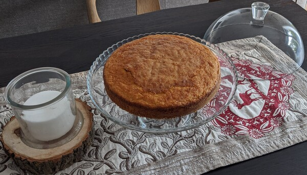

Il venerdì ci piace preparare sempre un dolce, dei muffin o dei biscotti.

Questa settimana avevamo voglia di una torta di carote.

Però volevamo potesse mangiarla anche Riccardo. Quasi tutte le ricette per la torta di carote fanno uso di farina di noci o di mandorle.

Alla fine siamo partitida questar ricetta [www.lacuisinetresjolie.it](https://www.lacuisinetresjolie.it/2013/04/torta-di-carote-soffice-senza-mandorle.html) e il risultato non è affatto male

## Ingredienti
* 400 g di carote
* 3 uova
* 200 g di zucchero
* 1 bicchiere di olio d'oliva
* 300 g di farina
* 1 bustina di lievito per dolci
* cannella

## Strumenti
* Fruste elettriche
* Teglia forno da 25cm di diametro
* Ciotola grande per frustare/impastare
* Ciotola media per le parti secche

## Procedimento

### Preprazioni anticipate
La primissima cosa da fare e pelare, lavare a grattuggiare non troppo fini le carote.

Volendo una torta morbida ho preferito non scolare le carote nel colino ma lasciarle umide.

Un'altra preparazione da fare in anticipo è pesare e setacciare nella ciotola media la farina e il lievito.

Alla farina e al lievito noi abbiamo poi aggiunto un bel po' di cannella perchè a noi piace 😉.

Prendere la teglia, imburrarla e infarinarla così che poi la torta si riesce a togliere farcilmente una volta cotta.

E in fine pre-riscaldare il forno a 180° statico.

### Impastaggio e Cottura

Mettere nella ciotola grande le uova e lo zucchero e iniziare a frustare a velocità media.

Aggiungere quindi prima l'olio e poi quando il composto è omogeneo, anche le componenti secche (farine, lievito, cannella).

Il composto diventerà cremoso ma molto dento, quindi spegnere le fruste e incrporare con una spatola le carote, la loro umidità ammorbidirà il composto.

A questo punto versare tutto l'impasto nella teglia e spargere un po' di sale e cannella sullo strato superiore così da far poi formare una crosticina in cottura 😋.

Lasciare in forno circa 25 minuti, a noi è uscita molto umida quindi forse qualche minuto in più è meglio!

