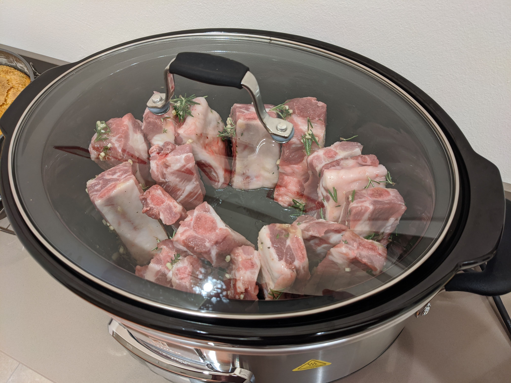

Ecco la prima ricetta nel libro di ricette.

Questo è stato il nostro secondo esperimento con la neo acquistata SlowCooker.

Costine di maiale con glassatura al miele cotte a bassa temperatura.



## Ingredienti (per 2 golosi)

* 1Kg di costine di maiale non troppo grasse
* 2 cucchiai di miele
* 2 cucchiai di olio
* 1 cucchiaio di aceto di vino bianco
* 2 spicchi di aglio
* Timo
* Rosmarino
* Sale
* Pepe
* Altre spezie/peperoncino se piace

## Preparazione

