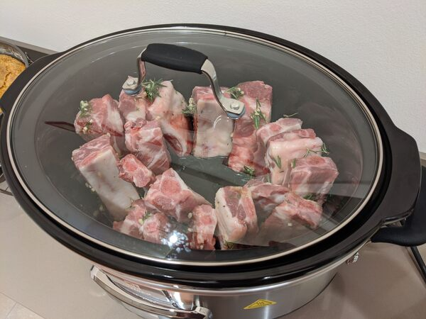
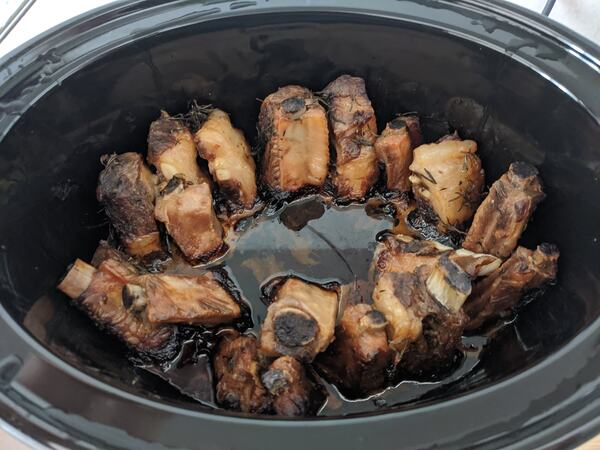

Ecco la prima ricetta nel libro di ricette, presa da [Ricette SlowCooker](https://www.ricetteslowcooker.it/costolette-al-miele/)

Questo è stato il nostro secondo esperimento con la neo acquistata SlowCooker.

Costine di maiale con glassatura al miele cotte a bassa temperatura.

## Ingredienti (per 2 golosi)

* 1Kg di costine di maiale non troppo grasse
* 2 cucchiai di miele
* 2 cucchiai di olio
* 1 cucchiaio di aceto di vino bianco
* 2 spicchi di aglio
* Timo
* Rosmarino
* Sale
* Pepe
* Altre spezie/peperoncino se piace

## Utensili

* Ciotola abbastanza grande per l'emulsione
* Tagliere e coltello per tritare gli aromi
* SlowCooker

## Preparazione

* Prendere la ciotola e inserire olio, aceto e il miele.
* Miscelare tutto per creare un emulsione e scogliere il miele
* Tritare tutti gli aromi e aggiungerli all'emulsione e lasciare insaporire qualche minuto
* Prendere una costina alla volta, bagnarla nell'emulsione metterla in piedi nella SlowCooker

* Far cuocere per 10 ore su Low

* Sbafare tutto

## Consigli

Se la SlowCooker lo permette mettere in modalità Buffet per qualche minuto prima di servire.

Si possono ripassare in forno sotto il grill se piace ma a noi non è sembrato necessario
