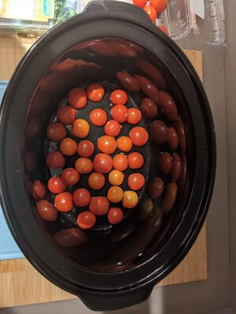
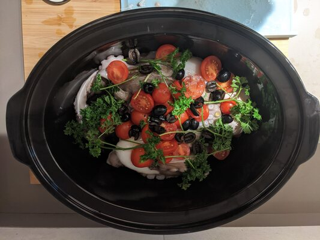
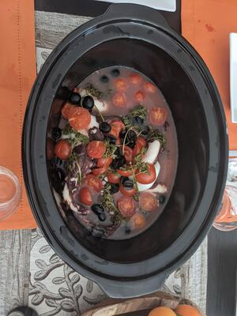
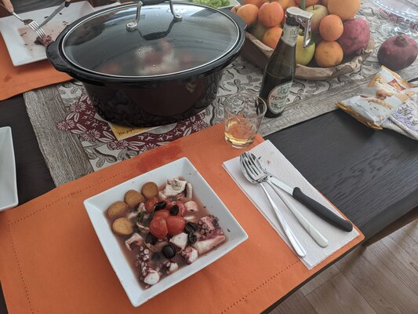

Oggi ci siamo dati al polpo alla luciana. Sempre in SlowCooker.

## Ingredienti (per 2 golosi)

* 1 Polpo grande decongelato
* 500gr di pomodorini
* Olive nere non troppo salate
* 2 cucchiai di olio
* 1 bicchiere di vino bianco
* Qualche rametto di prezzemolo
* Pepe
* Altre spezie/peperoncino se piace

## Utensili

* Tagliere e coltello
* SlowCooker

## Preparazione

* Lavare e tagliare i pomodorini a metà
* Stendere metà dei pomodorini nella pentola per fare da base

* Pulire il polpo lasciando parte della pelle sui tentacoli
* Adagiare il polpo sui pomodorini
* Ricoprire con i restanti pomodorini, le olive, il prezzemolo
* Bagnare con un po' di olio, di vino e speziare a gusto

* Far partire la cottura su High per 4 ore senza mai sollevare il coperchio

* Il sughetto è buono quanto il polpo si consigliano crostini!

